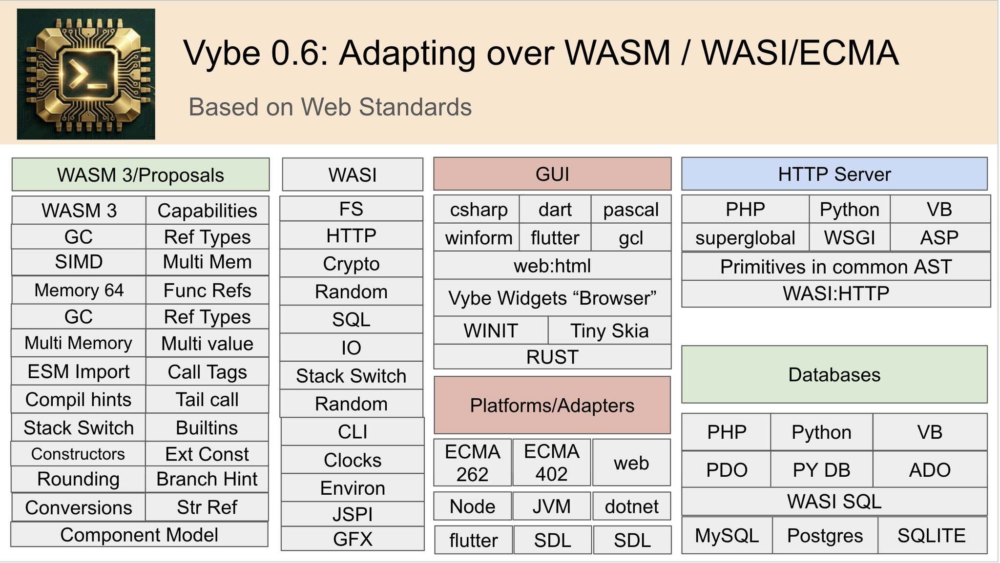
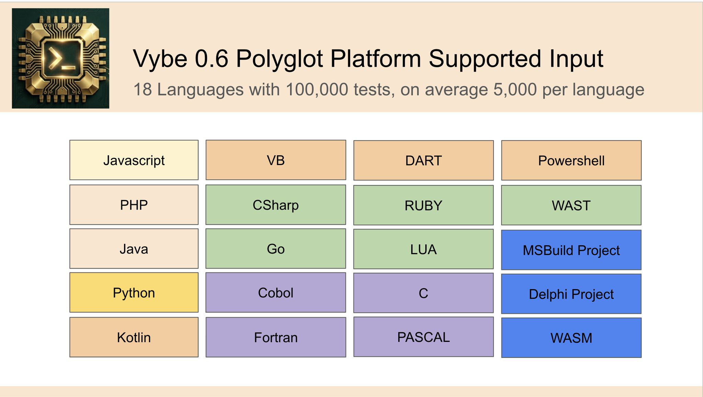
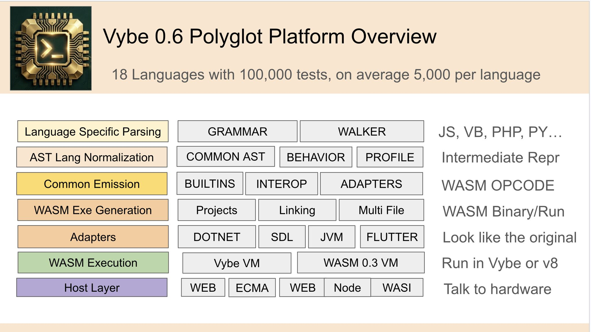
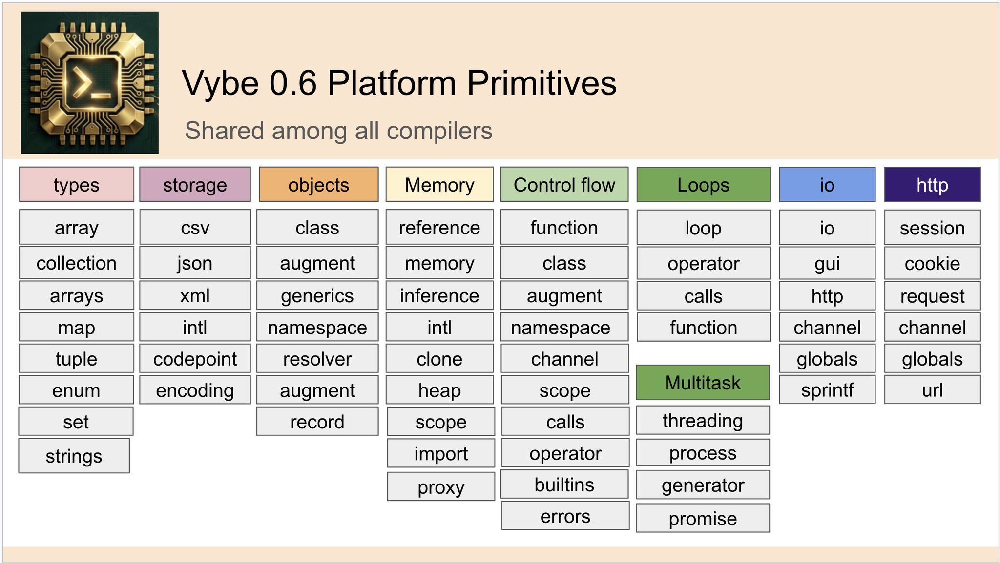

# Vybe v0.6.1

Vybe is a Rust workspace for compiling multiple source languages into one
shared JS-shaped AST and one shared WASM bytecode runtime. Every frontend is
"X over JS": the language grammar and walker normalize source-language syntax
and idioms into the common AST, then the shared compiler emits standard WASM
bytecode through `vybe_compiler::primitives`.

The VM executes WASM-compliant bytecode only. Runtime access is provided by
platform plugins with spec-shaped host namespaces such as `ecma:*`, `wasi:*`,
`web:*`, and `node:*`.







## Workspace Hierarchy

The workspace is organized by ownership. Language crates parse and normalize
source. Platform crates provide host or platform surfaces. `vybe_compiler`
contains the one shared compiler and shared emitter primitives. `vybe_runtime`
contains the VM and the plugin framework.

```text
crates/
  vybe_ast/
    Common AST and shared semantic IR. No runtime dependency.

  vybe_compiler/
    The shared compiler, shared emitter primitives, bundling, project loading,
    and dynamic compile/eval service.

    src/primitives/
      The shared emitter/primitives layer. This is where cross-language
      bytecode helpers live: collections, dict, strings, math, classes,
      closures, errors, loops, generators, promises, io, convert, reflection,
      and related WASM-emitting helpers.

    src/dynamic.rs
      Runtime compile/eval/include service used by language runtimes and tests.

    src/projects/
      Project loaders and single-file bundle loading.

  vybe_runtime/
    The VM and bytecode runtime, plus the plugin framework:
    Plugin trait, Framework, plugin registry, LanguageDef, PlatformDef,
    language hooks, namespace tree, profiles, capabilities, and host function
    registration APIs.

  testrunner/
    Extracted-test runner and harness tooling. Runs standalone files under
    tests/<lang>/<category>/ through the built `vybex` binary or a real runtime.

  vybex/
    Thin CLI/server/GUI launcher. It wires command-line behavior and calls into
    the compiler/runtime; language work should not live here.

  code_editor/
    Code editor and project-facing UI support.

languages/
  <lang>/
    One crate per language frontend. Each language crate owns:
      src/grammar.pest
      src/walker.rs
      src/profile
      src/normalize.rs or src/normalize_class.rs when needed
      src/emitter/dispatch.rs and adapters when it has common:<lang>.* builtins
      tests/<lang>/
      plugin registration through vybe_runtime::Plugin and LanguageDef

platforms/
  ecma/
    Host platform plugin for ECMA-262/402/WebIDL shaped host functions:
    ecma:array, ecma:string, ecma:object, ecma:math, ecma:date, ecma:json,
    ecma:regex, ecma:promise, ecma:reflect, ecma:symbol, ecma:value, and
    related globals/finalization.

  wasi/
    Host platform plugin for WASI-shaped capabilities:
    wasi:cli, wasi:clocks, wasi:random, wasi:filesystem, wasi:io,
    wasi:http, wasi:sockets, wasi:crypto, wasi:sql, environment, and process
    capability surfaces.

  web/
    Host platform plugin for WHATWG/W3C shaped surfaces:
    web:crypto, web:url, web:encoding, DOM/parser-related web APIs.

  node/
    Host platform plugin for Node-shaped surfaces:
    node:fs, node:os, node:path, node:process, node:http, child process, and
    related Node built-ins.

  vybe/
    Vybe-specific platform plugin. The only non-spec host namespace is
    vybe:gui for GUI controls, canvas, dialogs, and widget integration.

  libc/
    Emit platform for C/libc-style runtime behavior and pointer-oriented
    surfaces shared by C-like frontends where appropriate.

  dotnet/
    Emit platform for .NET-shaped APIs shared by VB and C#:
    System.Math, System.Console, collections, DateTime, TimeSpan, WinForms,
    LINQ-style adapters, and component descriptors.

  plib/
    Pascal component library platform.

  flutter/
    Flutter/Dart platform surface.

  wasm/
    WASM codec/disassembler platform.

tests/
  <lang>/<category>/<case>.<ext>
    Extracted standalone test files generated from language crate suites.

documentation/
  Architecture notes, debugging guides, plans, and language implementation
  guidance.
```

## Compilation Pipeline

Every language follows the same pipeline:

```text
Source language
  -> languages/<lang>/src/grammar.pest
  -> languages/<lang>/src/walker.rs normalizes to vybe_ast::Module
  -> languages/<lang>/src/profile maps builtins/methods
  -> crates/vybe_compiler/src/primitives emits WASM bytecode
  -> crates/vybe_runtime executes bytecode with platform plugins
```

Language-specific syntax and normalizations belong in `languages/<lang>/src/`.
Language-specific runtime adapters belong in `languages/<lang>/src/emitter/` and
are routed by profile entries such as `emit = "common:php.date"` through the
language's registered dispatch function. Shared bytecode helpers belong in
`crates/vybe_compiler/src/primitives/`. Host functions belong in platform
plugins and must remain spec-shaped.

## Supported Frontends

The workspace currently includes frontends for:

- C (`.c`, `.h`)
- C# (`.cs`)
- COBOL (`.cob`, `.cbl`, `.cobol`)
- Dart (`.dart`)
- Fortran (`.f90`, `.f95`, `.f03`, `.f08`, `.f18`, `.f`)
- Go (`.go`)
- Java (`.java`)
- JavaScript (`.js`, `.mjs`)
- Lua (`.lua`)
- Pascal / Delphi (`.pas`, `.pp`, `.dpr`, `.lpr`)
- PHP (`.php`, `.phtml`)
- Python (`.py`, `.pyw`)
- Ruby (`.rb`)
- Visual Basic (`.vb`)
- WebAssembly Text (`.wast`, `.wat`)

Project loaders currently support:

- `.vybe` (Vybe project)
- `.vbproj` (Visual Basic project)
- `.csproj` (C# project)
- `.pyproj` and `.ipyproj` (Python / IronPython project)
- `.dpr` and `.lpr` (Delphi / Lazarus project)

## Core Capabilities

- Multi-language compilation through one common AST and one shared compiler
- Shared WASM bytecode runtime with standard WASM opcodes only
- Cross-language emitter primitives in `vybe_compiler::primitives`
- Platform plugin host surfaces for ECMA, WASI, Web, Node, and Vybe GUI
- WASM emission via `--emit-wasm`
- AST, bytecode, trace, and debugger support from the CLI
- Sandboxed execution mode for restricted capabilities
- HTTP directory serving and programmatic server support in `vybex`
- GUI/editor-oriented crates for form and widget workflows

## Build

Build the workspace:

```bash
cargo build
```

Build optimized binaries:

```bash
cargo build --release
```

Run the CLI directly from the workspace:

```bash
cargo run -p vybex -- path/to/file.js
```

## CLI Usage

The executable name is `vybex`.

```text
vybex — Universal compiler

Usage: vybex [flags] <file>
       vybex --eval CODE --lang NAME [--virtual-path PATH]
       vybex --serve [--bind BIND] [BIND] [ROOT]

Flags:
  -d, --dump        Disassemble bytecode (no run)
      --dump-ast    Parse and print the prepared common AST
  -w, --emit-wasm   Compile to .wasm binary
      --eval CODE   Compile source from a string
      --lang NAME   Language for --eval (js, php, python, vb, ...)
      --virtual-path PATH  Source path used for relative imports in --eval
  -s, --sandbox     Restricted mode (safe capabilities only)
  -p, --portable    Minimal WASI-style runtime
  -t, --trace       Enable bytecode trace output
      --chunk NAME  Limit --dump/--trace output to a chunk name or index
      --serve       Start HTTP server for a directory
      --bind ADDR   With --serve: bind to ADDR instead of 127.0.0.1:8080
                    BIND defaults to 127.0.0.1:8080, ROOT to current dir
      --no-sandbox  With --serve: keep full host access
  -h, --help        Show this help
```

## Workspace Layout

```text
README.md
Cargo.toml
crates/
languages/
platforms/
examples/
documentation/
data/
tools/
tests/
```

- `crates/vybe_ast/` contains the common AST.
- `crates/vybe_compiler/` contains the shared compiler, shared emitter
  primitives, project loading, bundling, and dynamic compile/eval service.
- `crates/vybe_compiler/src/primitives/` contains the shared cross-language
  bytecode helpers used by the compiler and language/platform adapters.
- `crates/vybe_runtime/` contains the VM, plugin framework, registry,
  namespace tree, profile model, capabilities, and host function registration.
- `crates/testrunner/` contains the extracted-test runner and language harness
  emitters.
- `crates/vybex/` is the thin CLI/server launcher.
- `languages/` contains one crate per language frontend.
- `platforms/` contains host and emit platform plugins.
- `tests/` contains extracted standalone test cases generated from language
  suites for focused debugging with `testrunner`.
- `documentation/` contains architecture notes, plans, and debugging guides.

## Tests and Debugging

Use focused extracted tests while fixing a category:

```bash
testrunner run tests/php/sessions
testrunner run tests/fortran/pack_unpack_extended
testrunner run tests/dart/duration_datetime
```

Use `testrunner summary <lang>` to inspect saved failure summaries when a saved
run exists:

```bash
testrunner summary php
```

Language crate suites still live under `languages/<lang>/tests/<lang>/` and can
be run directly when appropriate:

```bash
cargo test -p vybe_language_fortran --test fortran --no-fail-fast
cargo test -p vybe_language_php --test php --no-fail-fast
```

For diagnosis, prefer the exact extracted file:

```bash
vybex --dump-ast tests/fortran/pack_unpack_extended/pack_int_even_positions_only.f90
vybex --dump tests/fortran/pack_unpack_extended/pack_int_even_positions_only.f90
VYBE_TRACE=1 vybex --trace tests/fortran/pack_unpack_extended/pack_int_even_positions_only.f90
```

## Where To Look Next

- `documentation/add_vybex_language.md` for the current language/plugin
  architecture.
- `documentation/fix_tests.md` for debugging workflow, ownership boundaries,
  and the fix priority ladder.
- `documentation/debugging.md` for AST dumps, bytecode dumps, tracing, and the
  interactive debugger.
- `documentation/directives.md` for profile/directive rules and avoiding
  language-specific special casing in common code.
- `crates/vybe_compiler/src/primitives/` for shared emitter primitives.
- `languages/<lang>/src/` for a language grammar, walker, profile, and
  language-owned adapters.
- `platforms/<platform>/` for platform-owned host or emit surfaces.

## License

Vybe is dual-licensed under `GPLv3` and a commercial license.

To be accepted, contributions must be able to ship under either license. By
submitting a contribution for inclusion, you are agreeing that the project may
distribute that contribution under both licensing tracks.
